# Facebook OAuth Setup

VideoSphere publishes **Facebook Reels** to a connected **Facebook Page** using OAuth 2.0. The deployer registers one Meta developer app and sets server environment variables; each VideoSphere user connects their Facebook account from **Profile → Connections**, then picks which Page to publish to.

| Purpose | Environment variables |
| ------- | --------------------- |
| Facebook connection | `FACEBOOK_APP_ID`, `FACEBOOK_APP_SECRET` |

VideoSphere builds redirect URIs from `NEXT_PUBLIC_APP_URL`, so set that variable to the exact URL you use in the browser (including port) **before** creating the Meta app.

```bash
# Local development
NEXT_PUBLIC_APP_URL=http://localhost:9624

# Production example
NEXT_PUBLIC_APP_URL=https://videos.example.com
```

OAuth callback path: `{NEXT_PUBLIC_APP_URL}/api/platforms/callback/facebook`

VideoSphere requests these Page permissions at connect time: `pages_show_list`, `pages_read_engagement`, `pages_read_user_content`, and `pages_manage_posts`. Add the same permissions on the Meta app (see Part 4).

---

## Development mode vs published app

New Meta apps start **Unpublished** (Development mode). Only Facebook accounts with a role on the app — **Administrator**, **Developer**, or **Tester** under **App roles** — can complete Login while the app is unpublished.

For a personal or homelab VideoSphere instance, that is usually enough: use your own Facebook account (the one that created the app) to connect (the creator of the app, by default, has the app role of **Administrator**). To let other Facebook users connect, you must navigate to **App roles** → **Roles** and add the user. Otherwise, **Publish** the app and complete Meta **App Review**.

---

## Part 1 — Create a Meta developer app

1. Open [developers.facebook.com](https://developers.facebook.com/), go to **My Apps**, and click **Create App**.

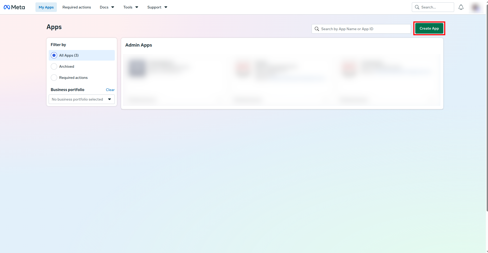

2. Enter **App name** (e.g. `VideoSphere`) and **App contact email**. Click **Next**.

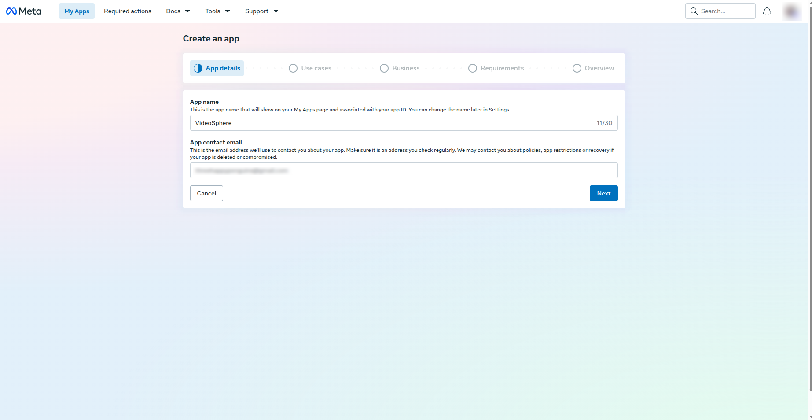

3. On **Add use cases**, open the **Filter by** list and choose **All (19)** so the full list is visible.

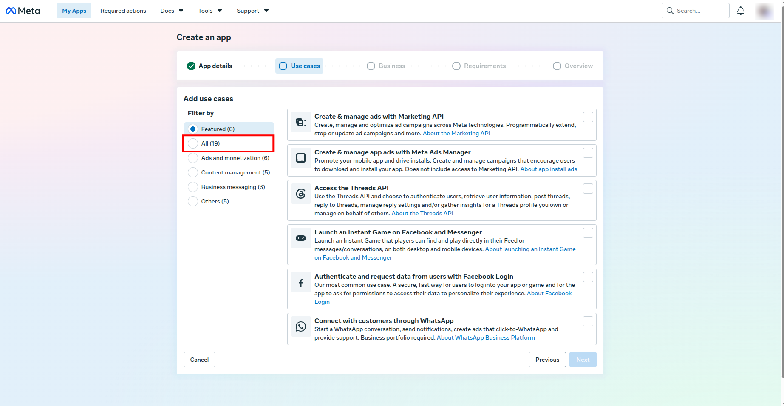

4. Select **Manage everything on your Page** — publish content and videos, moderate posts, and read Page engagement. Click **Next**.

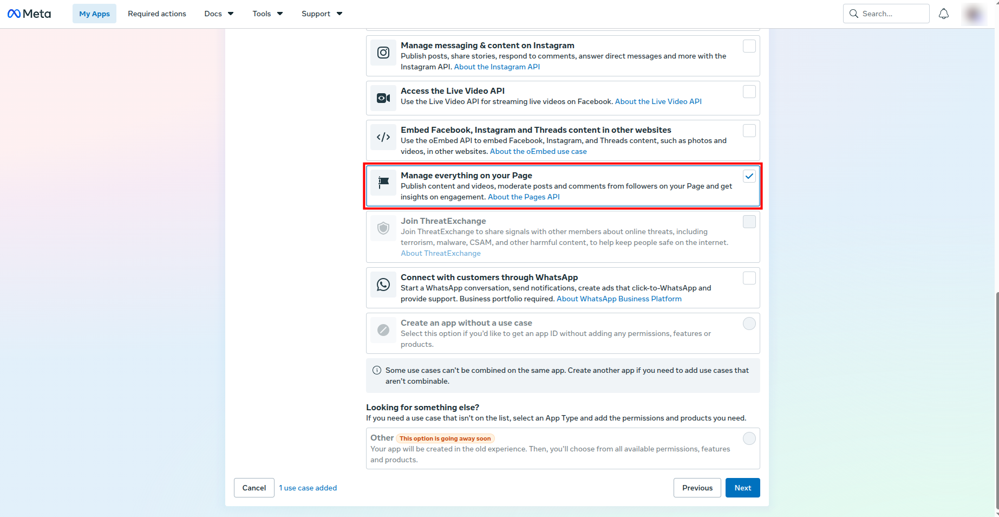

5. On **Business**, choose **I don't want to connect a business portfolio yet.** Click **Next**.

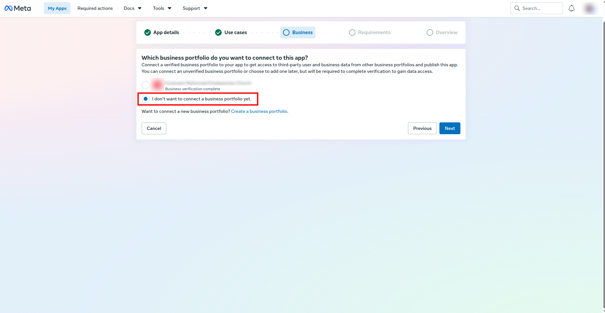

6. On **Publishing requirements**, confirm there are no extra requirements for your selection, then click **Next**.

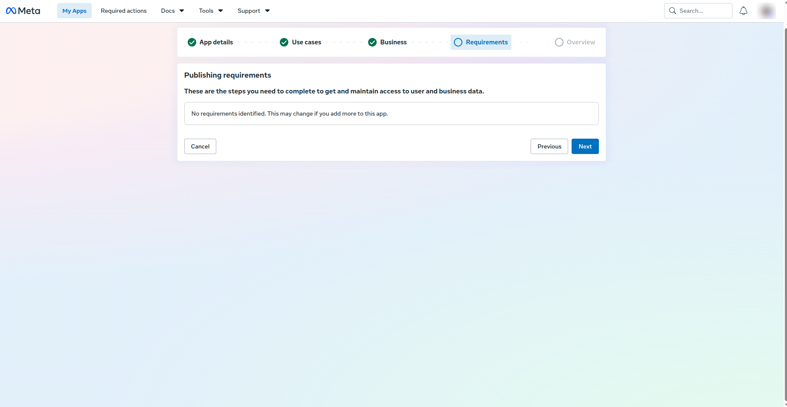

7. Review the overview and click **Create app**.

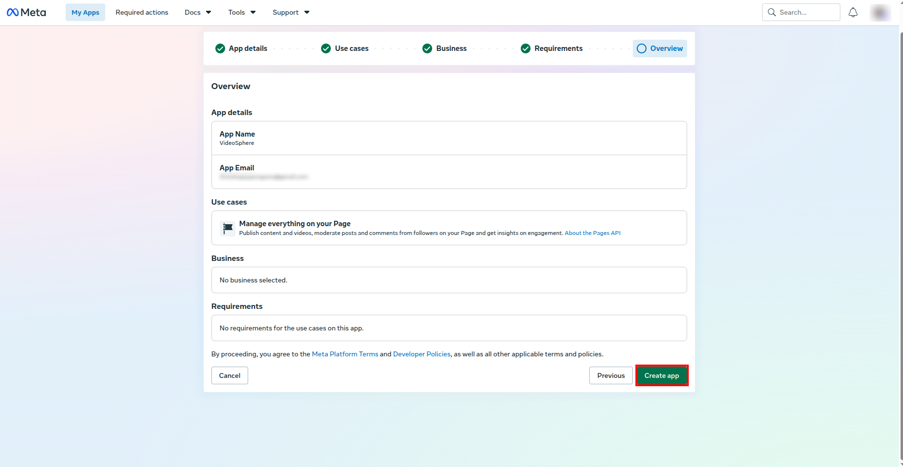

---

## Part 2 — Copy App ID and App Secret

8. From the app **Dashboard**, open **App settings → Basic** in the left sidebar.

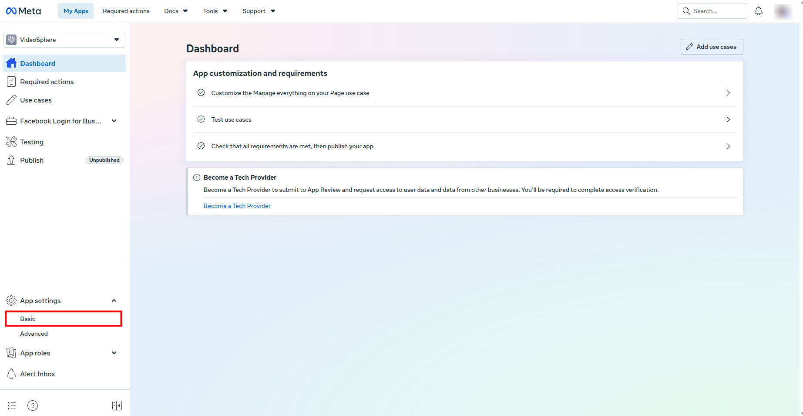

9. Copy **App ID** and **App secret** (click **Show** for the secret). These map to `FACEBOOK_APP_ID` and `FACEBOOK_APP_SECRET`.

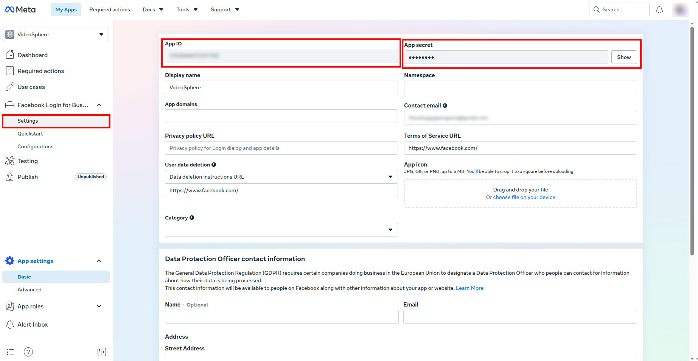

---

## Part 3 — Register OAuth redirect URIs

10. Open **Facebook Login for Business → Settings** in the left sidebar.

11. Under **Client OAuth settings**, find **Valid OAuth Redirect URIs**. Add every origin where VideoSphere runs:

    - Local: `http://localhost:9624/api/platforms/callback/facebook`
    - Production: `https://yourdomain.com/api/platforms/callback/facebook` (replace with your real host)

    The path must be exactly `/api/platforms/callback/facebook`. With **Use Strict Mode for redirect URIs** enabled, the URL must match character-for-character.

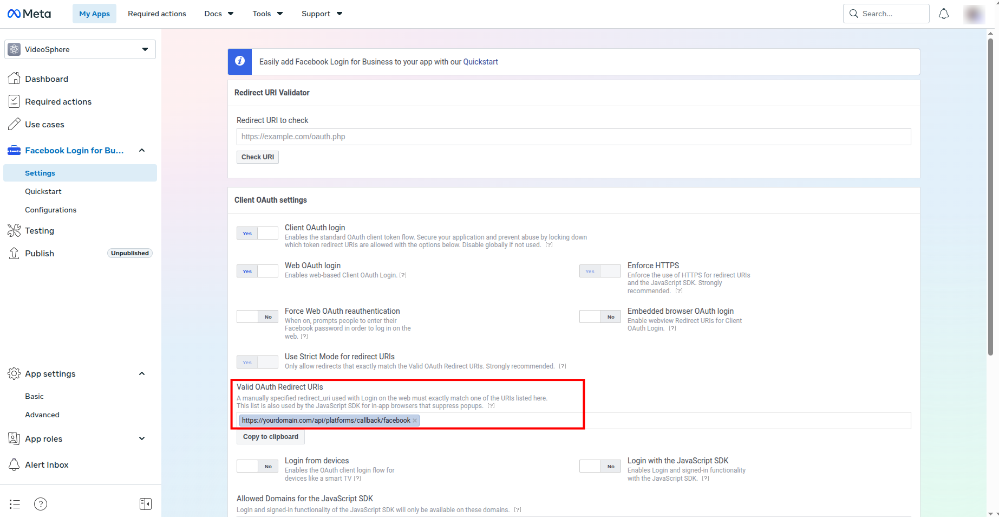

12. Click **Save Changes** at the bottom of the page. Meta does not apply new redirect URIs until you save.

---

## Part 4 — Add Page permissions

The **Manage everything on your Page** use case includes default permissions. VideoSphere also needs three Page permissions added explicitly.

13. Open **Use cases** in the left sidebar. On **Manage everything on your Page**, click **Customize**.

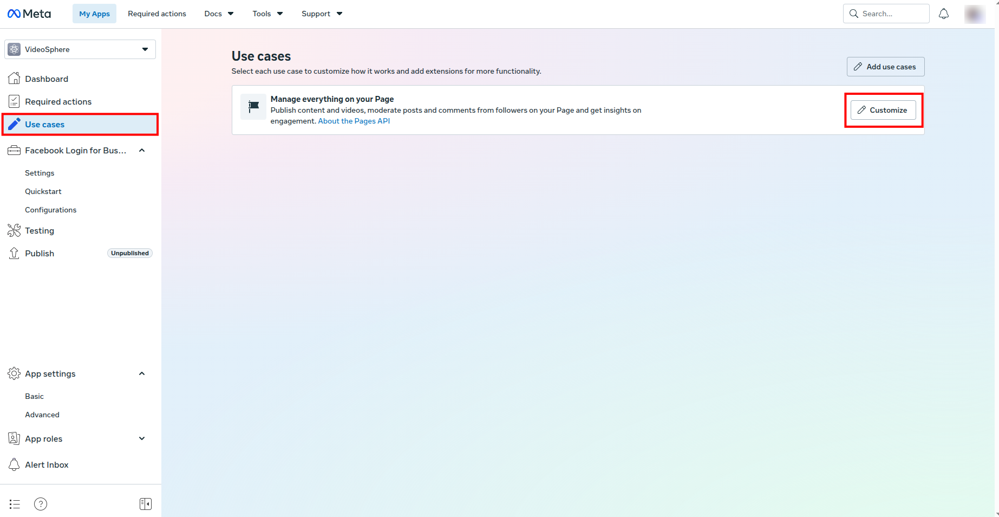

14. In the permissions list, click **+ Add** for each of the following (defaults such as `pages_show_list` and `public_profile` are fine as-is):

    - **`pages_manage_posts`** — create, edit, and delete Page posts (Reels publish)
    - **`pages_read_engagement`** — read Page content and engagement metadata
    - **`pages_read_user_content`** — read user-generated content on the Page (comments, ratings)

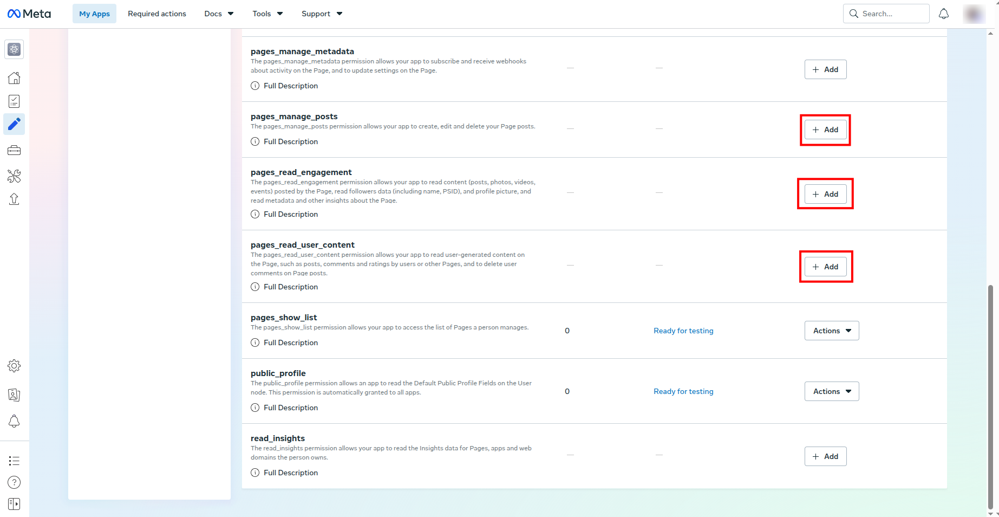

15. Confirm all three show **Ready for testing** in the status column.

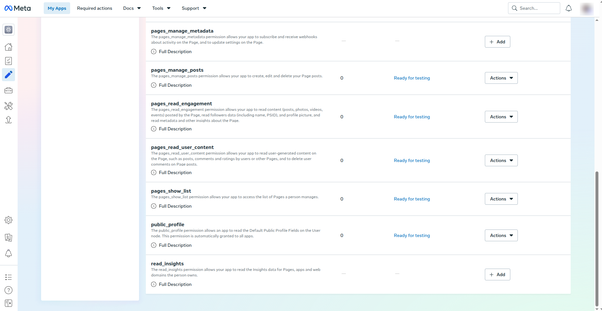

---

## Part 5 — Configure VideoSphere

16. Add credentials to `.env.local` for local `pnpm dev` or Docker Compose (`--env-file .env.local`), or to **Environment variables** on a Portainer stack (see [Deployment Guide](/deployment-guide)):

```bash
NEXT_PUBLIC_APP_URL=http://localhost:9624   # or your production URL

FACEBOOK_APP_ID=your_app_id
FACEBOOK_APP_SECRET=your_app_secret
```

17. Ensure `TOKEN_ENCRYPTION_KEY` is set on the server so OAuth tokens are stored encrypted in MongoDB.

18. Restart the app after updating environment variables (`pnpm dev` locally, or redeploy the container).

---

## Verify in VideoSphere

1. Sign in to VideoSphere.
2. Open **Profile → Connections** (`/profile/connections`).
3. Click **Connect Facebook** and sign in with a Facebook account that has a role on the Meta app (while unpublished) and admin access to at least one Facebook Page.
4. After redirect, pick the **Facebook Page** to publish Reels to and confirm.
5. Create or edit an upload draft, enable **Facebook** as a target, upload video, and distribute.

If OAuth fails, check the browser URL for `?error=facebook` on the Connections page and the app server logs.

---

## Callback URL reference

Replace the host with your `NEXT_PUBLIC_APP_URL` origin.

| Integration | Callback path |
| ----------- | ------------- |
| Facebook | `/api/platforms/callback/facebook` |

---

## Troubleshooting

### Connect redirects to `?error=facebook` immediately

- Confirm `FACEBOOK_APP_ID` and `FACEBOOK_APP_SECRET` are set and the app was restarted.
- Check server logs for missing env vars or token exchange errors.

### `URL Blocked` or redirect URI error

- The callback URL on the Meta app must match `{NEXT_PUBLIC_APP_URL}/api/platforms/callback/facebook` exactly.
- After editing redirect URIs, click **Save Changes** on the Facebook Login settings page.

### Login works for you but not for another Facebook user

- While the app is **Unpublished**, only accounts listed under **App roles** can log in. Add them in **App roles** → **Roles**, or publish the app and complete App Review.

### OAuth succeeds but no Pages appear in the picker

- The Facebook user must be an admin of at least one Page.
- Confirm `pages_show_list` is on the app and was granted during consent.

### Upload to Facebook fails after connecting

- Verify `pages_manage_posts`, `pages_read_engagement`, and `pages_read_user_content` are **Ready for testing** on the Meta app.
- Disconnect Facebook on **Profile → Connections**, reconnect, and re-select the Page so tokens include current permissions.
- Check upload job errors on **Uploads → History**.

### OAuth works locally but not in production

- Add the production callback URL under **Valid OAuth Redirect URIs** and click **Save Changes**.
- Set `NEXT_PUBLIC_APP_URL` to the URL users type in the browser.
- Redeploy after changing env vars.

---

## Related documentation

- [Deployment Guide](/deployment-guide) — full environment variable list for Docker and Portainer
- [Uploads, Livestreams & Distribution](/uploads-and-distribution) — connection matrix and Reels workflow
- [Draft Document & Upload Testing](/draft-document-and-upload-testing) — `platforms.facebook` metadata fields
- [`.env.example`](https://github.com/threehappypenguins/VideoSphere/blob/main/.env.example) — OAuth variable names in the repository
- [Meta Facebook Login documentation](https://developers.facebook.com/docs/facebook-login/)
