# Google OAuth Setup

VideoSphere uses **three separate Google OAuth clients** in the same Google Cloud project:

| Client | Purpose | Environment variables |
| ------ | ------- | --------------------- |
| **Google Sign-in** | Login and signup with Google | `GOOGLE_CLIENT_ID`, `GOOGLE_CLIENT_SECRET` |
| **YouTube Connection** | Upload and manage videos on a connected YouTube channel | `YOUTUBE_CLIENT_ID`, `YOUTUBE_CLIENT_SECRET` |
| **Google Drive Connection** | Backup uploads to Google Drive | `GOOGLE_DRIVE_CLIENT_ID`, `GOOGLE_DRIVE_CLIENT_SECRET` |

Each client has its own callback URL. VideoSphere builds redirect URIs from `NEXT_PUBLIC_APP_URL`, so set that variable to the exact URL you use in the browser (including port) **before** creating OAuth clients.

```bash
# Local development
NEXT_PUBLIC_APP_URL=http://localhost:9624

# Production example
NEXT_PUBLIC_APP_URL=https://videos.example.com
```

Email/password login works without Google OAuth. Create only the clients you need.

---

## Part 1 — Enable APIs

1. Open [Google Cloud Console](https://console.cloud.google.com/) and select your project (or create one). Go to **APIs & Services** → **Enabled APIs & services**, then click **+ Enable APIs and services**.
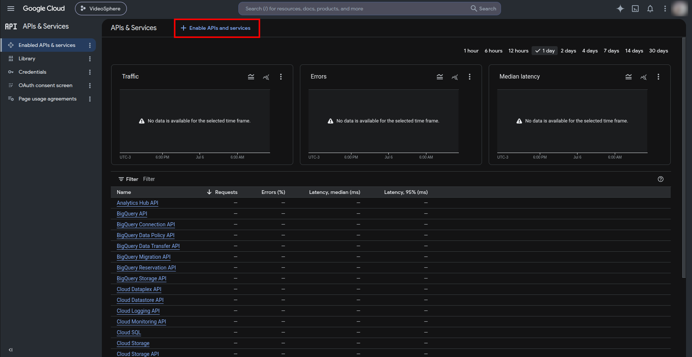

2. Search for **YouTube Data API v3** and open it.
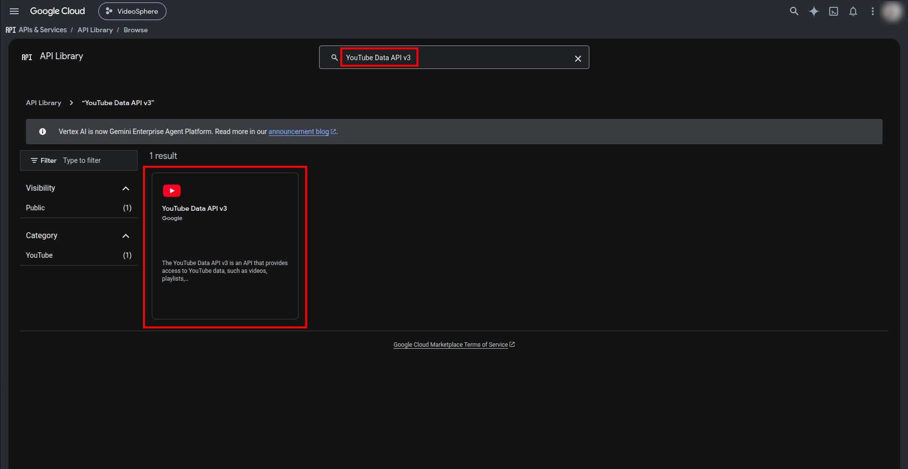

3. Click **Enable** if the API is not already enabled. When status shows **Enabled**, return to the API library.
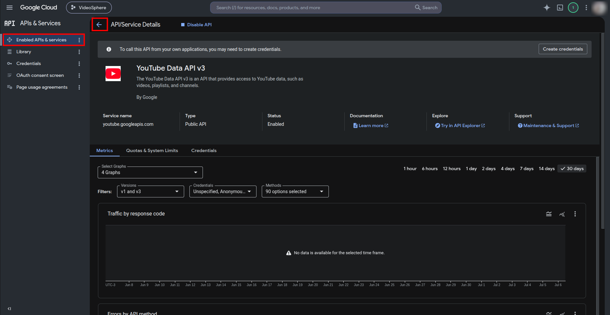

4. Search for **Google Drive API** and open it.
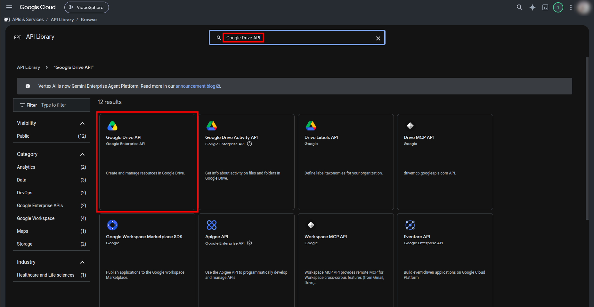

5. Click **Enable** if needed. When status shows **Enabled**, open **Google Auth Platform** → **OAuth consent screen** in the left sidebar (or **APIs & Services** → **OAuth consent screen** in the classic menu).
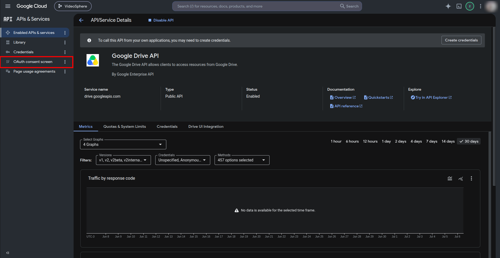

---

## Part 2 — OAuth consent screen (branding)

These steps configure the consent screen shared by all three OAuth clients.

6. On the OAuth **Overview** page, click **Get started**.
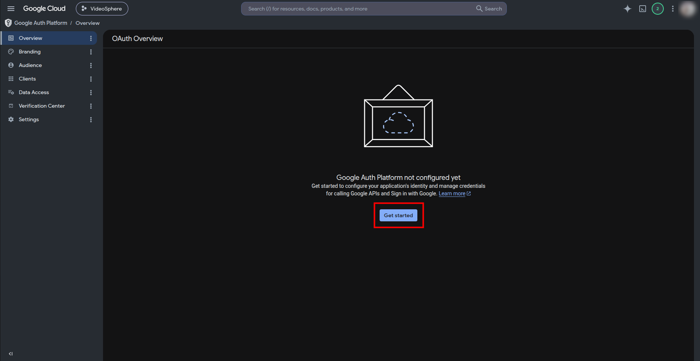

7. **App Information** — enter an app name (e.g. `VideoSphere`) and a support email. Click **Next**.
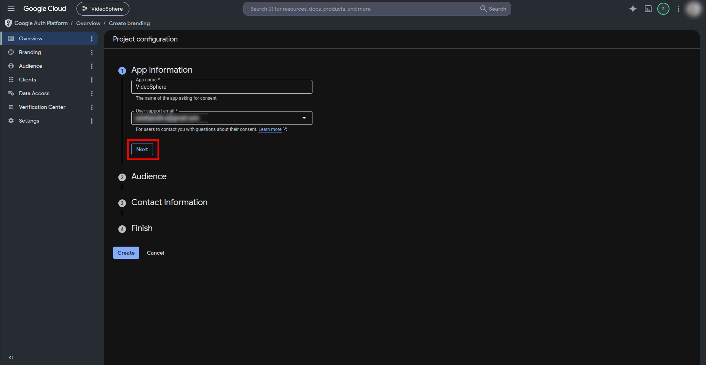

8. **Audience** — choose **External** for personal or homelab use (Google Workspace internal apps can choose Internal). Click **Next**.
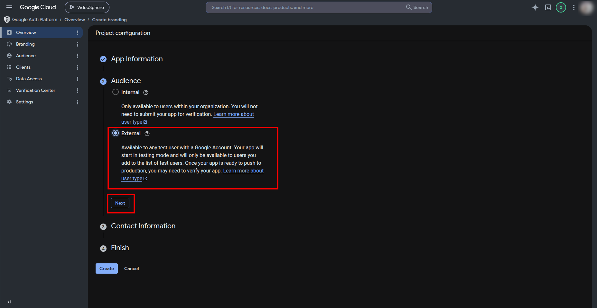

9. **Contact Information** — add a developer contact email. Click **Next**.
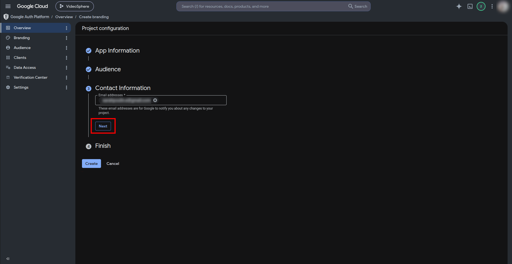

10. **Finish** — review the summary, accept the Google API Services policy, then click **Continue** and **Create**.
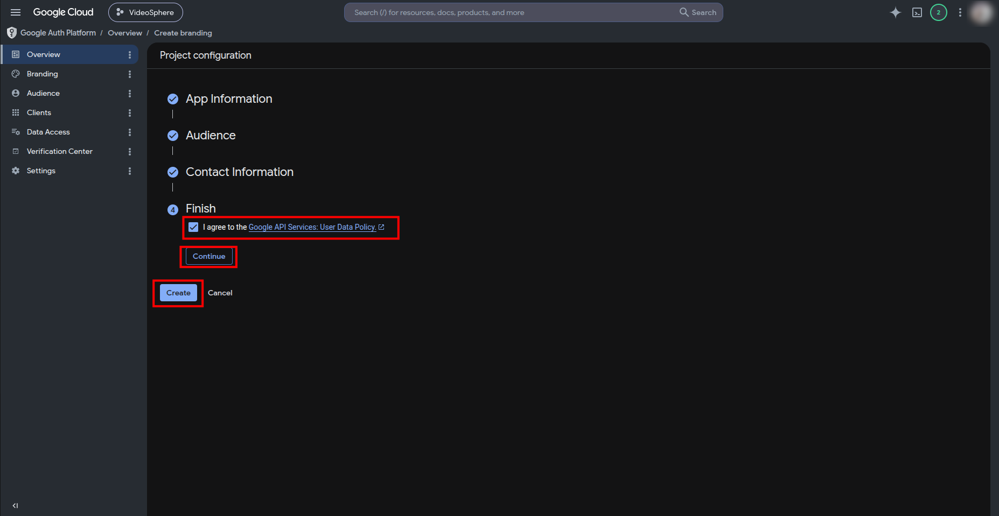

---

## Part 3 — Data Access (scopes)

Platform connections need explicit scopes on the consent screen. Sign-in uses standard OpenID scopes (`openid`, `email`, `profile`) and does not require extra entries here.

11. From **OAuth Overview**, open **Data Access** (left sidebar).
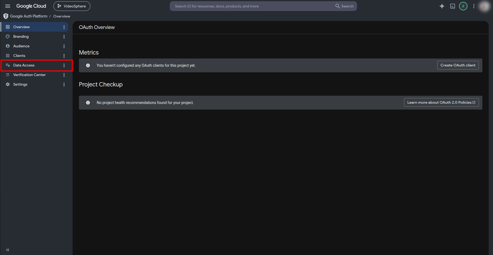

12. Click **Add or remove scopes**.
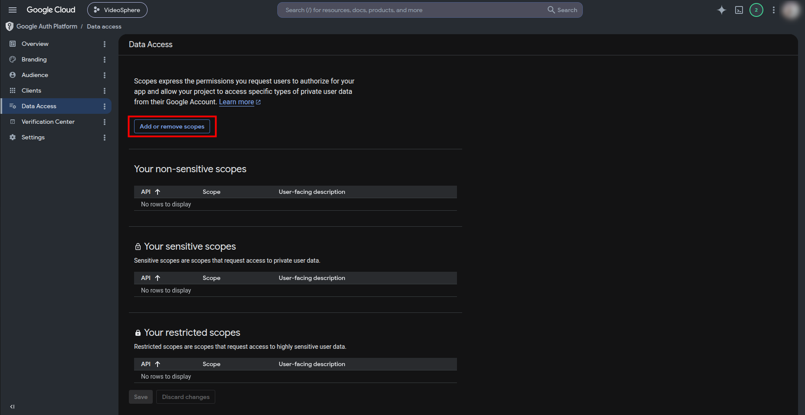

### YouTube scopes

Add each scope below. In the scope picker, filter by `/auth/youtube` to find them quickly.

13. Select **Manage your YouTube account** (`.../auth/youtube`).
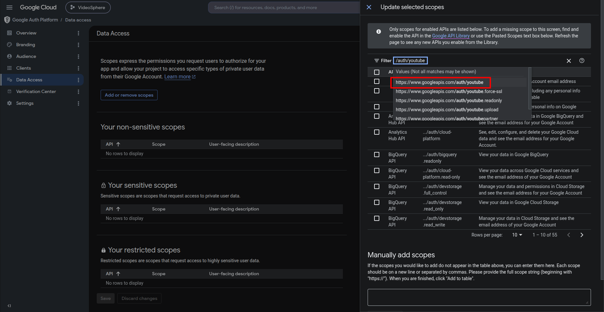

14. Check `Manage your YouTube account` and then click on the small `x` to clear the filter.
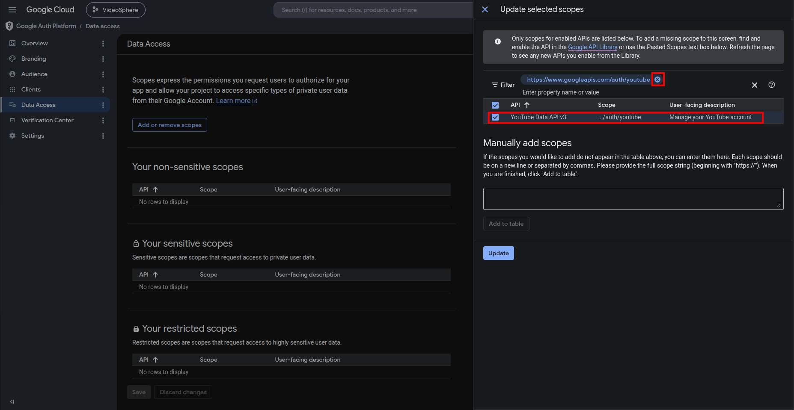

15. Select **See, edit, and permanently delete your YouTube videos, ratings, comments and captions** (`.../auth/youtube.force-ssl`), check it, and clear the filter.


16. Select **Manage your YouTube videos** (`.../auth/youtube.upload`), check it, and clear the filter.
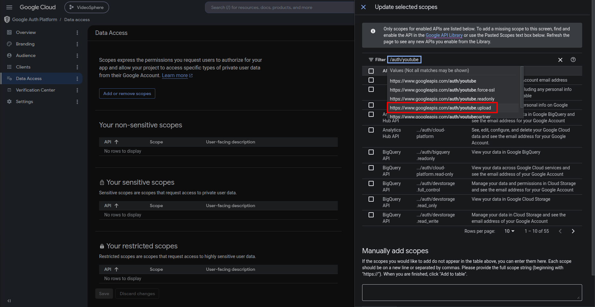

17. Select **View your YouTube account** (`.../auth/youtube.readonly`), check it, then click **Update**.
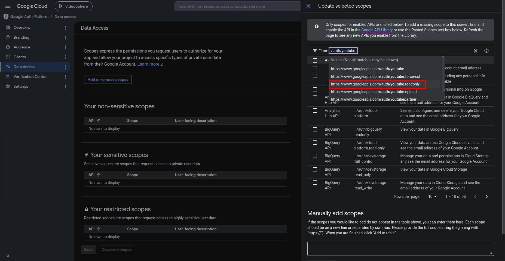

18. Confirm all four scopes are there, then click **Save**, and head to **Audience**.
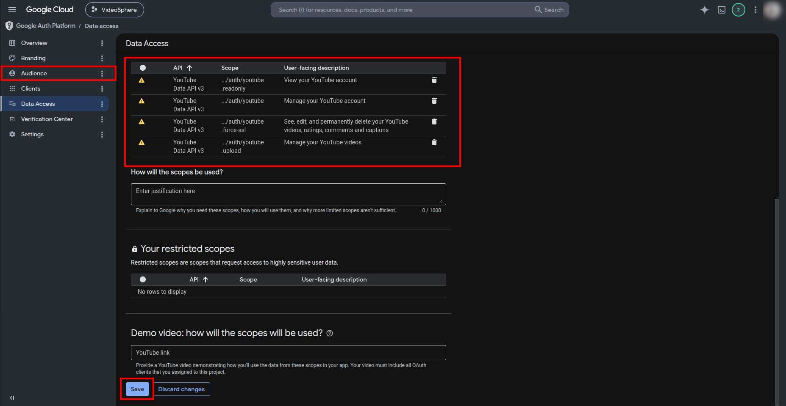

---

## Part 4 — Publishing the App

If the app stays as **Testing**, only accounts listed as test users can complete OAuth, and manual reconnection must happen roughly on a weekly basis. **Publish app** is the solution, and verification is **optional**. The user, when connecting with OAuth, will see a warning that the app is not verified.

19. In **Audience**, under **Testing**, click **Publish app**. When finished, go to **Clients** to create OAuth credentials.
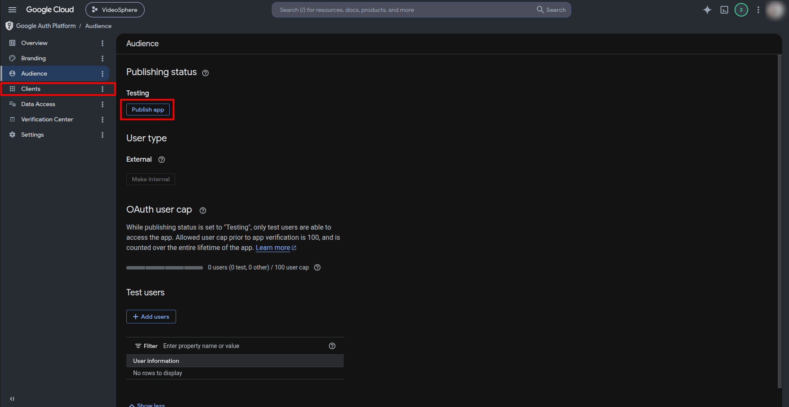

---

## Part 5 — Create OAuth clients

Create **three** clients. Use **Web application** as the application type for each. Store credentials in the same place as your other VideoSphere secrets: `.env.local` for local dev or Docker Compose, or **Environment variables** on a Portainer stack (see [Deployment Guide](/deployment-guide)).

> **Same Cloud project:** Sign-in, YouTube, and Drive clients normally share one OAuth consent screen. Google treats that as one app grant for the user — revoking a token from one client can invalidate the others. VideoSphere therefore does **not** call Google's revoke endpoint when disconnecting Google **sign-in** or abandoning a failed sign-in; it only clears local sign-in credentials so YouTube/Drive stay connected. Platform disconnect (YouTube/Drive) still revokes that platform's token.

### Google Sign-in client

20. On **Clients**, click **+ Create client**.
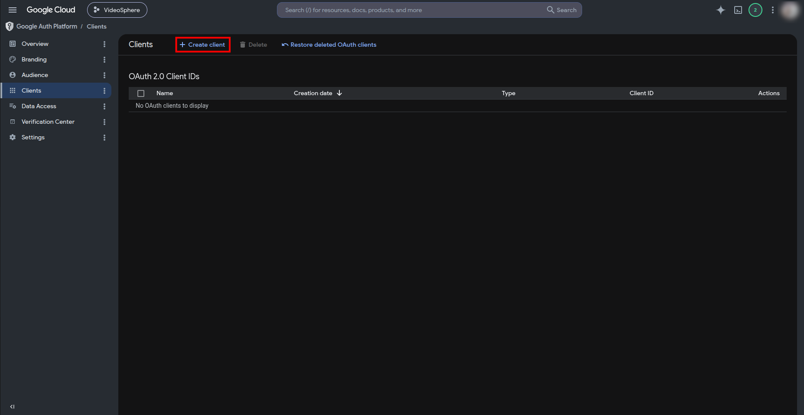

21. Configure the client:

   - **Name:** `Google Sign-in` (or similar)
   - **Authorized JavaScript origins:** leave empty unless you add a separate web origin later
   - **Authorized redirect URIs** — add the production URL, and optionally the local URL:
     - `http://localhost:9624/api/auth/oauth/callback`
     - `https://your-domain.com/api/auth/oauth/callback` (replace with your real host)

   Click **Create**.


22. Copy the **Client ID** and **Client secret** into `.env.local` (local `pnpm dev` or Docker Compose with `--env-file .env.local`), or into your Portainer stack **Environment variables**:

```bash
GOOGLE_CLIENT_ID=your-google-sign-in-client-id
GOOGLE_CLIENT_SECRET=your-google-sign-in-client-secret
```

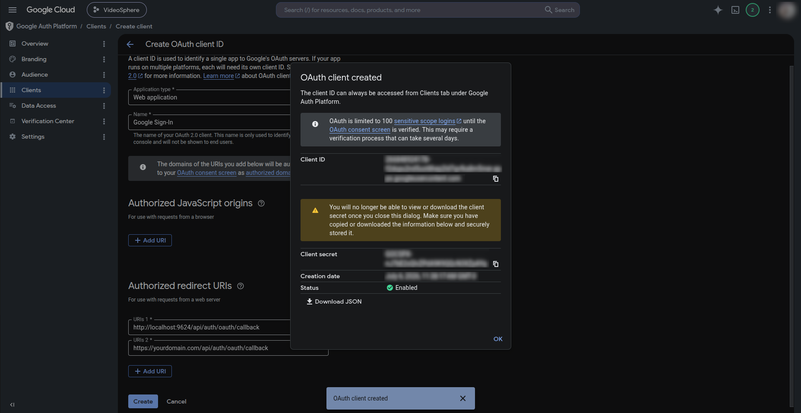

### YouTube Connection client

23. Click **+ Create client** again:

   - **Name:** `YouTube Connection`
   - **Authorized redirect URIs:**
     - `http://localhost:9624/api/platforms/callback/youtube`
     - `https://your-domain.com/api/platforms/callback/youtube`

```bash
YOUTUBE_CLIENT_ID=your-youtube-client-id
YOUTUBE_CLIENT_SECRET=your-youtube-client-secret
```


### Google Drive Connection client

24. Click **+ Create client** again:

   - **Name:** `Google Drive Connection`
   - **Authorized redirect URIs:**
     - `http://localhost:9624/api/platforms/callback/drive`
     - `https://your-domain.com/api/platforms/callback/drive`

```bash
GOOGLE_DRIVE_CLIENT_ID=your-google-drive-client-id
GOOGLE_DRIVE_CLIENT_SECRET=your-google-drive-client-secret
```

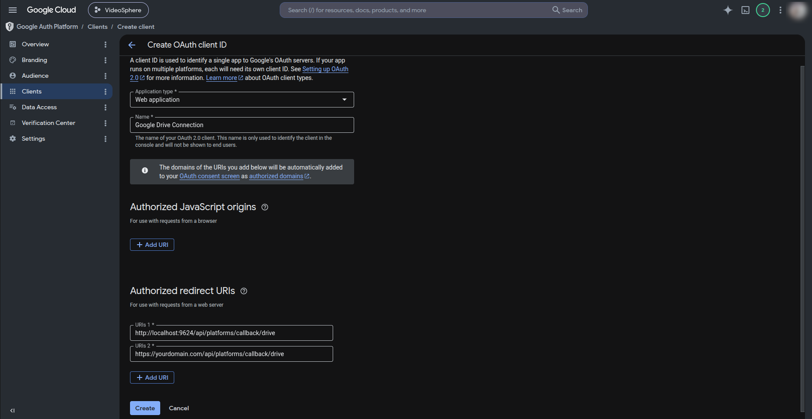

---

## Verify in VideoSphere

1. Restart the app after updating environment variables (`pnpm dev` locally, or redeploy the container).
2. **Sign-in:** open `/login` and use **Continue with Google** (requires `GOOGLE_CLIENT_*`).
3. **Platform connections:** sign in, go to **Profile → Connections**, and connect **YouTube** and/or **Google Drive**.

If OAuth fails, check the browser URL for `?error=` query parameters and the app logs.

---

## Callback URL reference

Replace the host with your `NEXT_PUBLIC_APP_URL` origin (your domain name, ie `http://localhost:9624` or `https://yourdomain.com`).

| Integration | Callback path |
| ----------- | ------------- |
| Google Sign-in | `/api/auth/oauth/callback` |
| YouTube | `/api/platforms/callback/youtube` |
| Google Drive | `/api/platforms/callback/drive` |

---

## Troubleshooting

### `redirect_uri_mismatch`

The redirect URI sent by VideoSphere does not match any URI on the OAuth client. Confirm:

- `NEXT_PUBLIC_APP_URL` matches the URL in the browser (including `http` vs `https` and port `9624` locally).
- The same origin is registered on the correct client (Sign-in vs YouTube vs Drive use **different** clients and URIs).

### `access_denied` or login blocked in Testing mode

Add the Google account under **Audience → Test users**, or publish the app.

### YouTube connect works but uploads fail with permission errors

Disconnect YouTube on **Profile → Connections** and reconnect so Google issues a fresh token with current scopes. After adding the full `youtube` scope in the codebase, existing connections may need reconnecting.

### OAuth works locally but not in production

Update all three clients with production redirect URIs, set `NEXT_PUBLIC_APP_URL` to the public URL, and redeploy. If you terminate TLS at a reverse proxy, the public URL must still match what users type in the browser.

---

## Related documentation

- [Deployment Guide](/deployment-guide) — full environment variable list for Docker and Portainer
- [Uploads, Livestreams & Distribution](/uploads-and-distribution) — connecting platforms from the UI
- [`.env.example`](https://github.com/threehappypenguins/VideoSphere/blob/main/.env.example) — all OAuth variable names in the repository
