# R2 Storage Module

Cloudflare R2 integration for VideoSphere. Provides utility functions for generating presigned URLs and managing temporary video storage.

## Overview

**Module:** `lib/r2.ts`
**Purpose:** S3-compatible Cloudflare R2 client for direct browser-to-R2 uploads
**Features:**
- Presigned upload URLs (15 minute expiry)
- Presigned download URLs (1 hour expiry)
- Object deletion
- Environment validation

## Environment Setup

Create an R2 account and bucket in Cloudflare Dashboard:

1. **Cloudflare Dashboard** → **Storage & databases** → **R2 Object Storage** → **Overview** → **Create bucket**
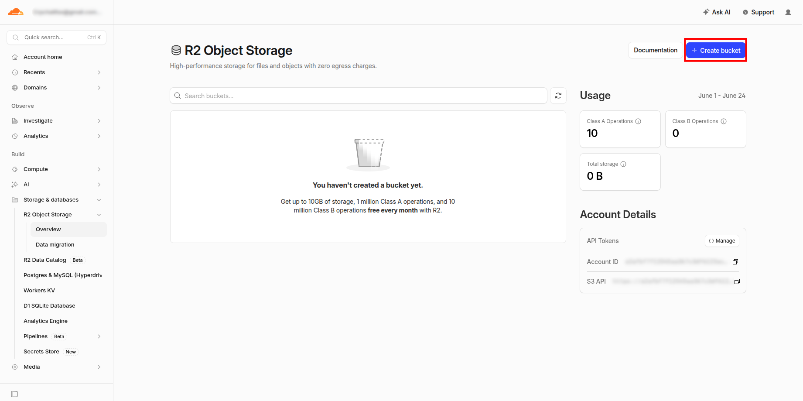

2. Call it `videosphere-uploads` and keep the defaults.
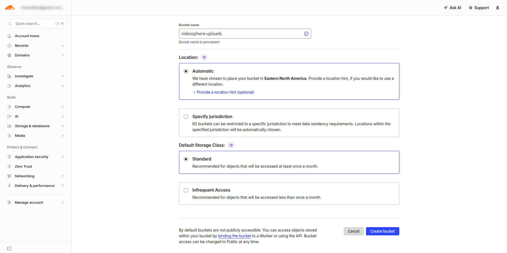

3. Click on R2 Object Storage
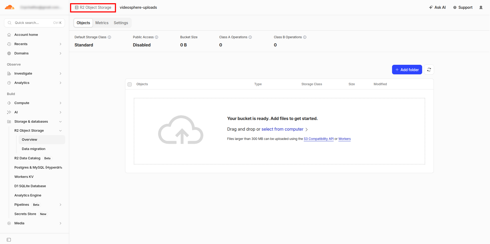

4. **Account Details** → **Manage**
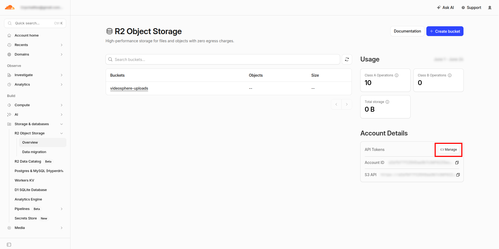

5. **Account API Tokens** → **Create Account API token**


6. **Create Account API Token**
  - Permissions: `Object Read & Write`
  - Specify bucket(s): `Apply to specific buckets only` and choose `videosphere-uploads`
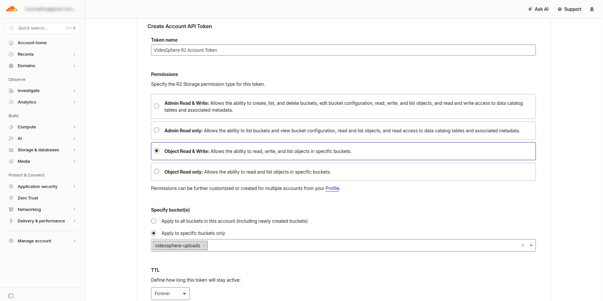

7. Add credentials to `.env.local` (**hint**: Account ID is found in Account Details in step 4):
    ```bash
    R2_ACCOUNT_ID=your-account-id
    R2_ACCESS_KEY_ID=your-access-key
    R2_SECRET_ACCESS_KEY=your-secret-key
    R2_BUCKET_NAME=videosphere-uploads
    ```
    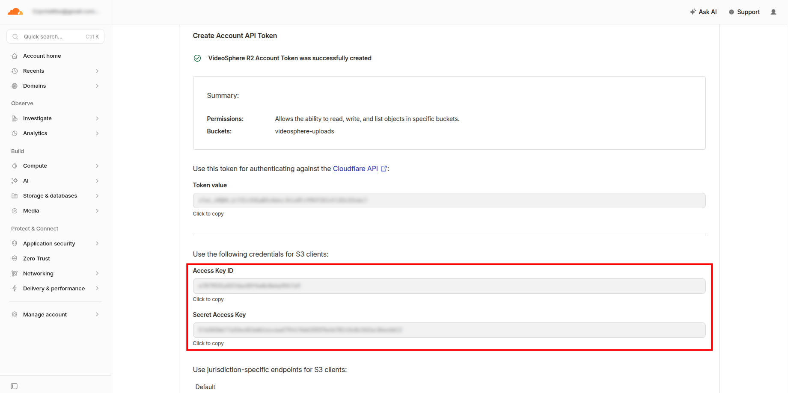

8. Click on R2 Object Storage:
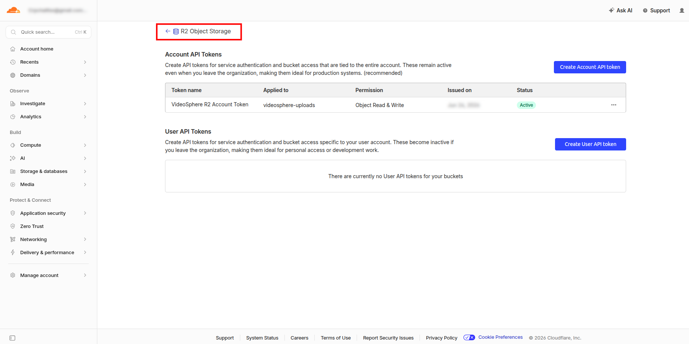

9. Click on your new bucket:
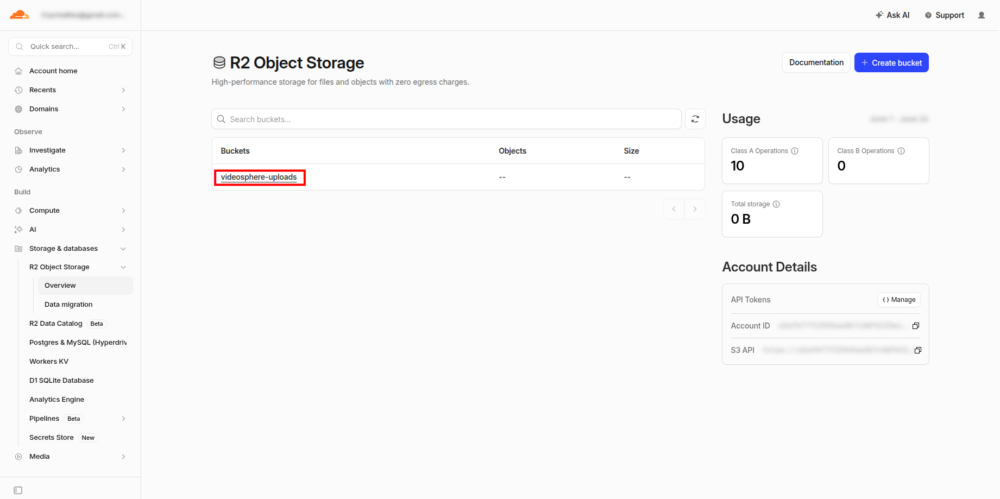

10. Go to the bucket **Settings*:
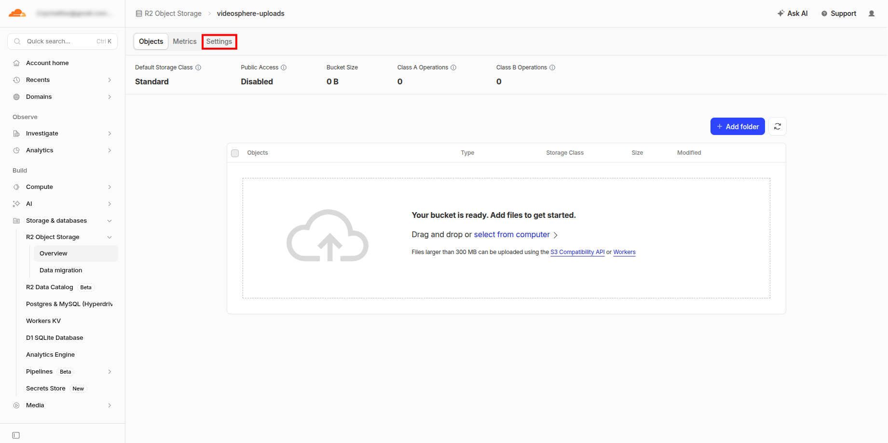

11. Go to **CORS Policy**:


12. Add a **CORS Policy**:
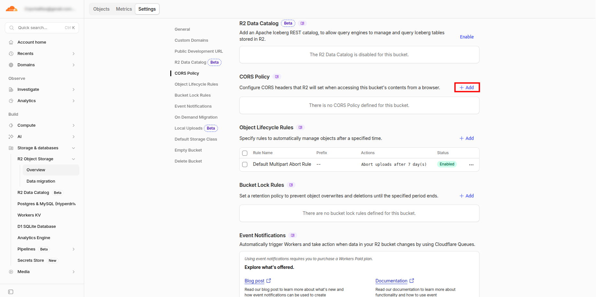

13. Copy and Paste the following (change the domain):
    ```
    [
      {
        "AllowedOrigins": [
          "https://mydomain.com"
        ],
        "AllowedMethods": [
          "GET",
          "PUT",
          "POST",
          "DELETE",
          "HEAD"
        ],
        "AllowedHeaders": [
          "*"
        ],
        "ExposeHeaders": [
          "ETag"
        ],
        "MaxAgeSeconds": 3600
      }
    ]
    ```

    If you are doing local development, you can add more domains:

    ```
    "AllowedOrigins": [
      "http://localhost:9624",
      "https://mydomain.com"
    ],
    ```
    

14. Edit **Object Lifecycle Rules**
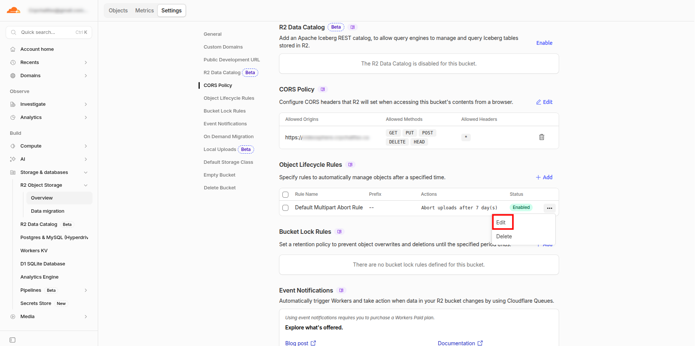

15. **Object Lifecycle Rules**

    Suggested rules (feel free to change accordingly):
    - Delete uploaded objects after `2` `Days`
    - Abort incomplete multipart uploads after `1` `Days`
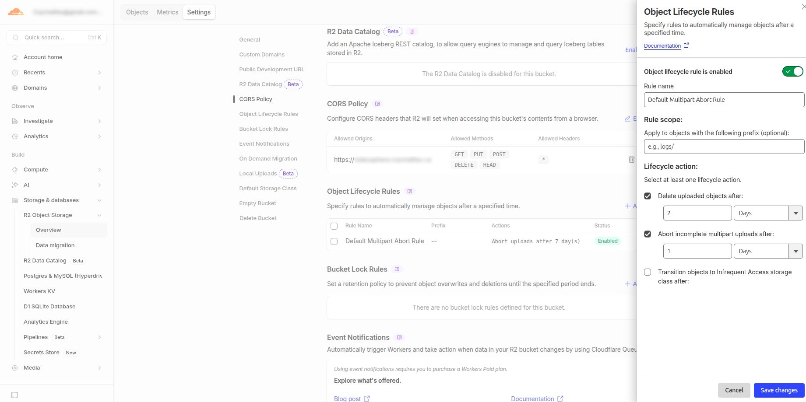

## API Reference

### `getPresignedUploadUrl(key, contentType)`

Generate a presigned URL for direct browser-to-R2 uploads.

**Parameters:**
- `key` (string): Object path in R2 (e.g., `temp/uploads/user-123/video.mp4`)
- `contentType` (string): MIME type (e.g., `video/mp4`)

**Returns:** `Promise<string>` - Presigned PUT URL (expires 900 seconds)

**Security:**
- Content-Type is part of the signature; clients cannot upload different types
- 15-minute expiry prevents URL replay attacks

**Example:**
```typescript
const url = await getPresignedUploadUrl(
  "temp/uploads/user-123/video.mp4",
  "video/mp4"
);

// Client can now upload directly:
fetch(url, {
  method: "PUT",
  body: fileBlob,
  headers: { "content-type": "video/mp4" }
});
```

### `getObjectUrl(key)`

Generate a presigned URL for downloading files from R2.

**Parameters:**
- `key` (string): Object path in R2

**Returns:** `Promise<string>` - Presigned GET URL (expires 3600 seconds)

**Use Cases:**
- Distribution engine reading video files
- Admin access to uploaded files
- Download endpoints

**Example:**
```typescript
const url = await getObjectUrl("temp/uploads/user-123/video.mp4");

// Distribution service fetches from this URL
const response = await fetch(url);
const videoBuffer = await response.arrayBuffer();
```

### `deleteObject(key)`

Delete an object from R2.

**Parameters:**
- `key` (string): Object path to delete

**Returns:** `Promise<void>`

**Use Cases:**
- Cleanup after distribution completion
- Remove failed uploads
- Free up storage after 72-hour retention

**Example:**
```typescript
await deleteObject("temp/uploads/user-123/video.mp4");
```

### `getBucketName()`

Get configured bucket name (for debugging/display).

**Returns:** string

### `getR2Endpoint()`

Get R2 endpoint URL (for debugging/display).

**Returns:** string - e.g., `https://account-id.r2.cloudflarestorage.com`

## Architecture

### Presigned Upload Flow

```
Client                          NextJS API                 R2
  |                              |                          |
  +------ POST /api/uploads -----> Authenticate
  |       presign request         |                          |
  |                               +---> getPresignedUploadUrl--->
  |                               |      (AWS SDK)          |
  |       <---- { uploadUrl } -----+<--- presigned PUT URL--+
  |                               |                          |
  +------ PUT { file } ----------->
  |       uploadUrl               (Direct to R2)            |
  |                               |      +-- PUT /temp/...  |
  |       <---- 200 OK ------------------+                  |
  |                               |                          |
  +------------- Verify ---------> Create Upload Job
  |       (Poll /api/uploads/job) Persist document in MongoDB
```

### Key Design Decisions

1. **AWS SDK for JavaScript**
   - Standard library for S3-compatible storage
   - Works with Cloudflare R2 via endpoint configuration
   - No additional Worker infrastructure needed

2. **Presigned URLs vs Direct API**
   - Don't expose R2 credentials to client
   - Client uploads directly to R2 (fast, low server load)
   - Server generates time-limited, content-restricted URLs

3. **15-Minute Upload Expiry (NF-08)**
   - Prevents old URLs being reused
   - Forces re-authentication for new uploads
   - Limits window for compromised URLs

4. **Path Structure: `temp/uploads/{userId}/{timestamp}/{filename}`**
   - Organizes files by user and time
   - Enables cleanup jobs to find old files
   - Prevents directory traversal attacks

## Error Handling

All functions throw descriptive errors:

```typescript
try {
  const url = await getPresignedUploadUrl("", "video/mp4");
} catch (error) {
  console.error(error.message);
  // → "Object key is required"
}
```

Common errors:
- `Missing required environment variable: R2_ACCOUNT_ID`
- `Object key is required`
- `Content type is required`
- `Failed to generate upload URL for key "...": [AWS error]`

## Testing

Run tests:
```bash
pnpm test __tests__/lib/r2.test.ts
pnpm test __tests__/api/uploads/presign.test.ts
```

Tests cover:
- URL generation with correct expiry times
- Content-type signature validation
- Error handling
- Path sanitization
- Authentication checks

## Security Best Practices

1. **Never commit credentials** - Always use `.env.local` (in `.gitignore`)
2. **Restrict API token permissions** - R2 tokens should only have `s3.read` and `s3.write`
3. **Use short-lived URLs** - 15min for uploads, 1hr for downloads
4. **Lock content type** - Prevents upload of wrong file types
5. **Enable CORS on bucket** - If presigned URLs used from browser
6. **S3 object metadata** - Store user ID, timestamp, original filename for audit trail

## Troubleshooting

### "Unable to locate credentials"
```
Solution: Ensure R2_ACCESS_KEY_ID and R2_SECRET_ACCESS_KEY are set in .env.local
```

### "NoSuchBucket"
```
Solution: Verify R2_BUCKET_NAME exists and API token has access
```

### "SignatureDoesNotMatch"
```
Possible causes:
- Client sent different Content-Type than presigned URL specifies
- Clock skew between server and AWS (check system time)
- Credentials are invalid or expired
```

### "RequestTimeTooSkewed"
```
Solution: Sync your system clock (time difference > 15 minutes with AWS)
```

## Related Features

- **VU-04**: Videos uploaded to R2 as temporary staging storage
- **NF-08**: Presigned URLs expire within 15 minutes
- **VU-07**: Files auto-cleanup after 72 hours (separate background task)
- **VU-01**: Support uploads up to 5 GB
- **VU-02**: Supported formats: MP4, MOV, AVI, MKV, WebM

## Dependencies

- `@aws-sdk/client-s3` - S3 client for R2
- `@aws-sdk/s3-request-presigner` - Presigned URL generation

## References

- [Cloudflare R2 Documentation](https://developers.cloudflare.com/r2/)
- [AWS SDK v3 Presigned URLs](https://docs.aws.amazon.com/sdk-for-javascript/latest/developer-guide/s3-example-presigned-url.html)
- [S3 Presigned URLs Best Practices](https://docs.aws.amazon.com/AmazonS3/latest/userguide/PresignedUrlUploadObject.html)
