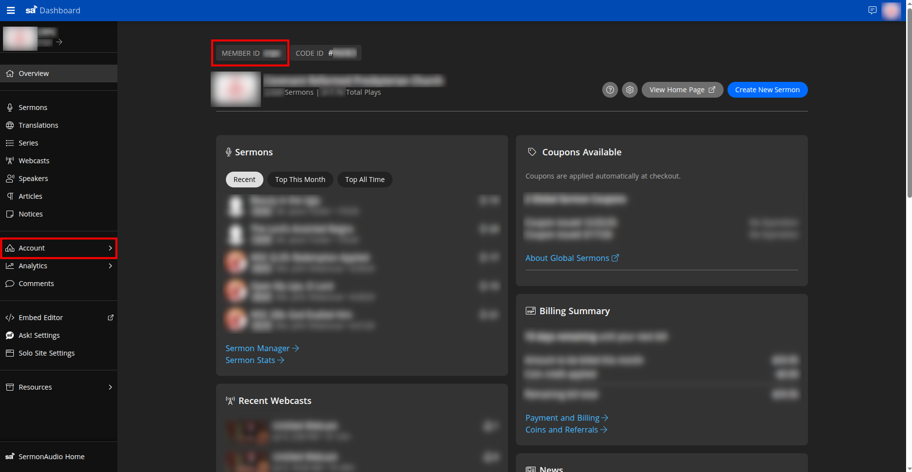
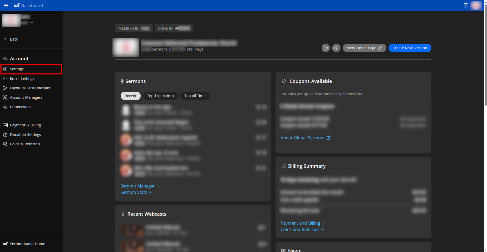
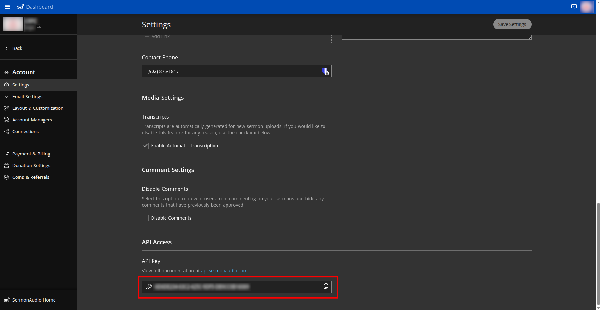

# SermonAudio API Setup

VideoSphere publishes sermons to [SermonAudio](https://www.sermonaudio.com/) using an **API key** and **Broadcaster ID**. Unlike YouTube or Google Drive, there is no OAuth flow and **no deployer environment variables** — each user enters their own credentials in the app.

| VideoSphere field | Where to find it in SermonAudio |
| ----------------- | ------------------------------ |
| **Broadcaster ID** | **Member ID** on the dashboard |
| **API Key** | **Account → Settings → API Access** |
| **Label** (optional) | Any friendly name you choose in VideoSphere (defaults to the Broadcaster ID) |

The server encrypts the API key in MongoDB (`TOKEN_ENCRYPTION_KEY` must be set on the VideoSphere instance). Credentials are verified against `GET https://api.sermonaudio.com/v2/node/broadcasters/{broadcasterID}` before they are saved.

---

## Part 1 — Find your Broadcaster ID (Member ID)

1. Sign in to the [SermonAudio dashboard](https://www.sermonaudio.com/dashboard). On the **Overview** page, find **Member ID** under your church or broadcaster name at the top of the main panel. In VideoSphere, enter this value as **Broadcaster ID**.

   Do **not** use **Code ID** — that is a different identifier.

---

## Part 2 — Open API settings

2. In the left sidebar, expand **Account**, then click **Settings**.

---

## Part 3 — Copy your API key

3. Scroll to the bottom of the **Settings** page to **API Access**. Copy the **API Key** (use the copy icon on the right of the field). API documentation is at [api.sermonaudio.com](https://api.sermonaudio.com/).

Treat the API key like a password. Do not commit it to git or share it in chat.

---

## Part 4 — Connect in VideoSphere

4. In VideoSphere, sign in and open **Profile → Connections** (`/profile/connections`).

5. Click **Connect SermonAudio** (or **Edit** if you already connected).

6. Paste your credentials:

   - **API Key** — from step 3
   - **Broadcaster ID** — the **Member ID** from step 1
   - **Label** (optional) — display name on the Connections page

7. Click **Connect**. VideoSphere verifies the key and Broadcaster ID with SermonAudio, then stores them encrypted.

8. When creating or editing an upload draft, enable **SermonAudio** as a target and fill in sermon-specific fields (speaker, series, event type, schedule, etc.). See [Uploads, Livestreams & Distribution](/uploads-and-distribution).

---

## Troubleshooting

### `SermonAudio API key or broadcaster ID could not be verified`

- Confirm **Broadcaster ID** is the **Member ID**, not Code ID.
- Copy the API key again from **Account → Settings → API Access** (no extra spaces).
- Ensure the SermonAudio account is active and the key has not been rotated on their side without updating VideoSphere.

### Connect succeeds but uploads fail later

- Open **Profile → Connections**, click **Edit** on SermonAudio, and re-enter the API key if it was regenerated on SermonAudio.
- Check upload job errors on **Uploads → History** for SermonAudio-specific messages.

### Credentials cannot be saved

- The VideoSphere operator must set `TOKEN_ENCRYPTION_KEY` on the server (see [Deployment Guide](/deployment-guide)). Without it, encrypted storage for platform secrets will not work.

---

## Related documentation

- [Uploads, Livestreams & Distribution](/uploads-and-distribution) — connection matrix and draft metadata
- [Draft Document & Upload Testing](/draft-document-and-upload-testing) — `platforms.sermon_audio` JSON fields
- [SermonAudio API reference](https://api.sermonaudio.com/)
