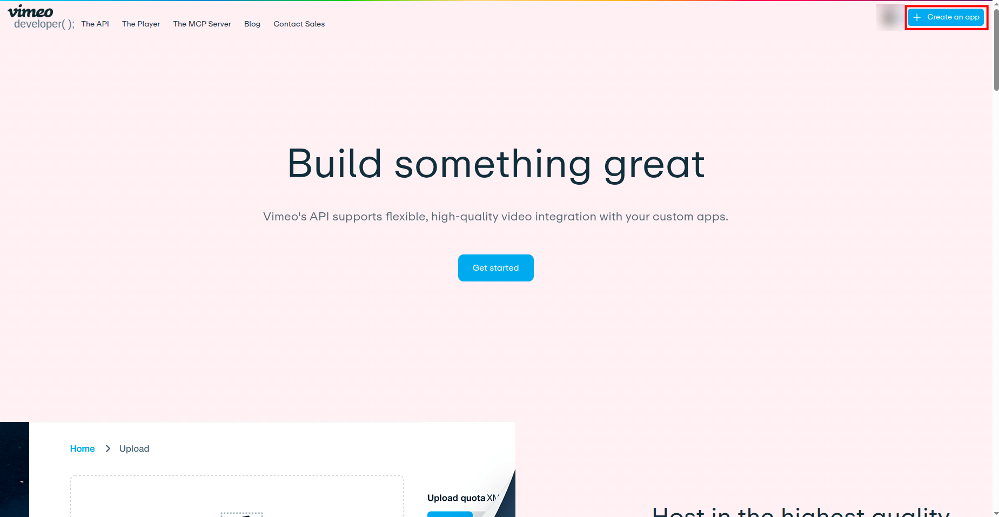
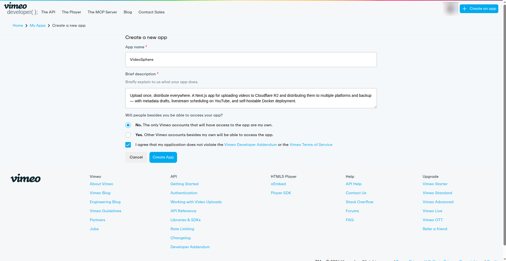
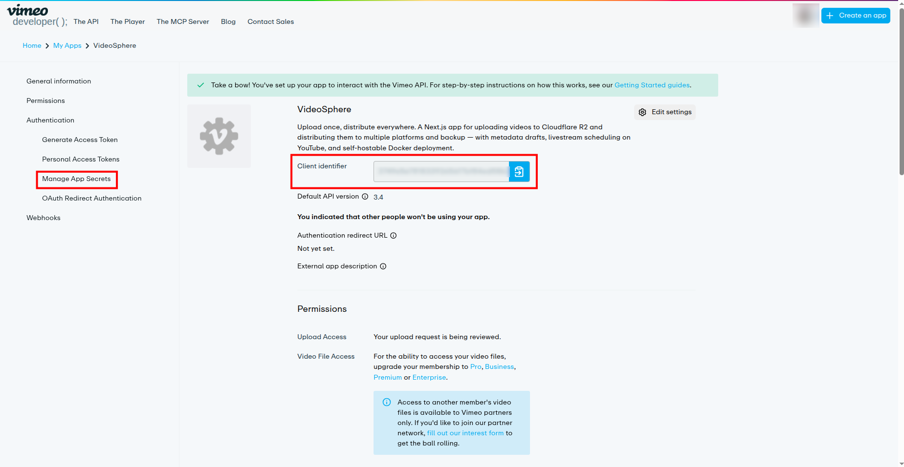
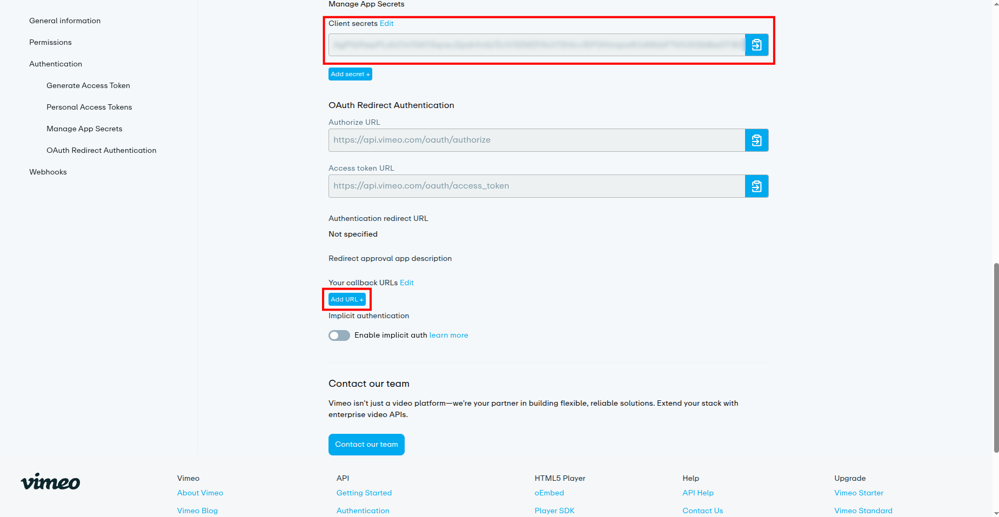
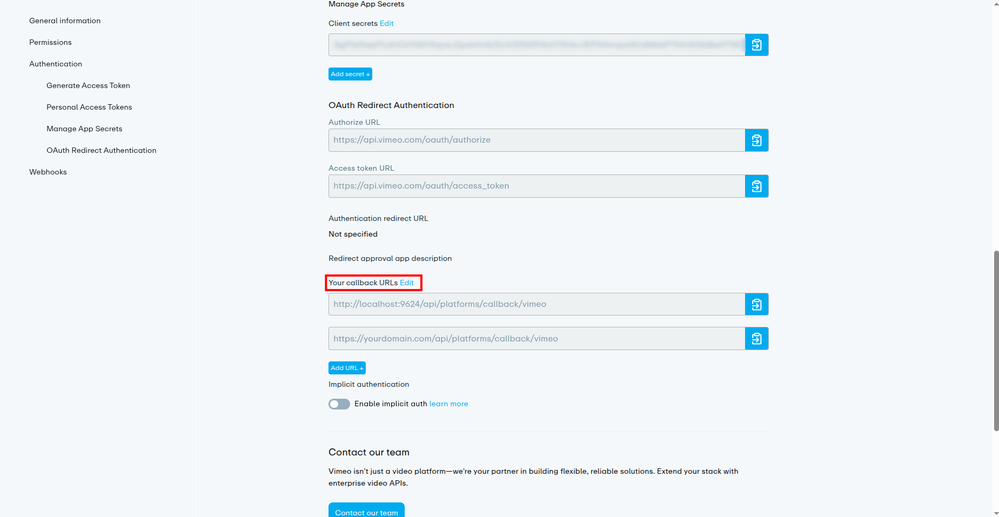
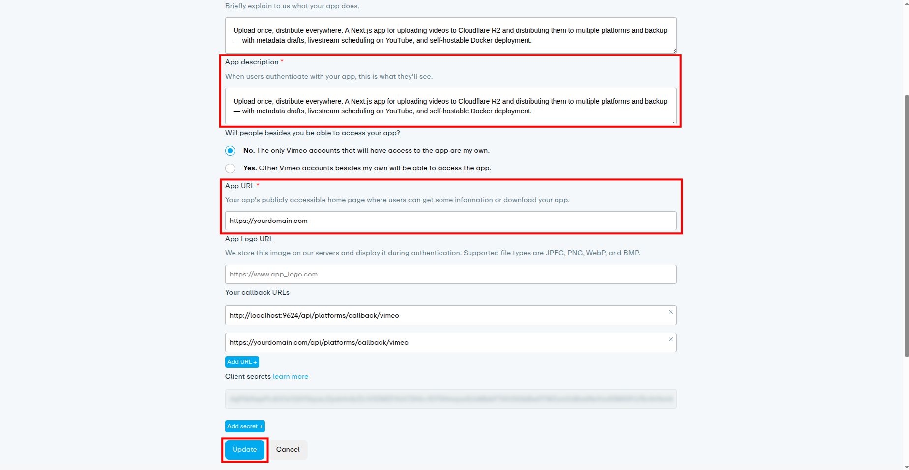
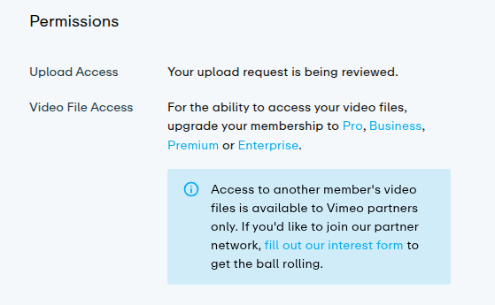
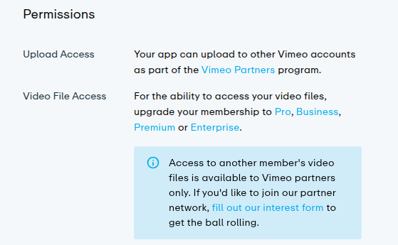

# Vimeo OAuth Setup

VideoSphere publishes videos to Vimeo using **OAuth 2.0**. The deployer registers one Vimeo developer app and sets server environment variables; each VideoSphere user connects their own Vimeo account from **Profile → Connections**.

| Purpose | Environment variables |
| ------- | --------------------- |
| Vimeo connection | `VIMEO_CLIENT_ID`, `VIMEO_CLIENT_SECRET` |

VideoSphere builds redirect URIs from `NEXT_PUBLIC_APP_URL`, so set that variable to the exact URL you use in the browser (including port) **before** creating the Vimeo app.

```bash
# Local development
NEXT_PUBLIC_APP_URL=http://localhost:9624

# Production example
NEXT_PUBLIC_APP_URL=https://yourdomain.com
```

OAuth callback path: `{NEXT_PUBLIC_APP_URL}/api/platforms/callback/vimeo`

VideoSphere requests scopes `upload`, `edit`, `public`, and `private`. The callback rejects the connection if Vimeo does not grant `upload`.

---

## Important limitations (read first)

Vimeo’s developer program imposes restrictions that affect real-world use of VideoSphere.

### Upload Access must be approved

After you create an app, **Permissions → Upload Access** shows *“Your upload request is being reviewed.”* (see step 12). VideoSphere **cannot upload to Vimeo** until Vimeo grants Upload Access — including uploads to **your own** Vimeo account tied to the developer app.

In practice, approval often does **not** happen on its own. Contact Vimeo support and ask them to approve **Upload Access** for your app. Until that status changes, OAuth may complete but distribution to Vimeo will fail.

When approved, the Permissions text changes (see step 13). That wording refers to the [Vimeo Partners](https://developer.vimeo.com/) program and is misleading for most self-hosted setups — see the next section.

### Other VideoSphere users cannot connect their Vimeo accounts

When creating the app, Vimeo asks whether people besides you will use the app (step 2). You can change this later under **Edit settings** (step 10).

**Choosing “Yes. Other Vimeo accounts besides my own will be able to access the app” does not enable multi-user OAuth in practice.** Even after Upload Access is approved, only the Vimeo account that owns the developer app has been observed to connect successfully. Other VideoSphere users on the same instance cannot complete Vimeo OAuth with a different Vimeo login.

The maintainer’s experience:

- Upload Access was approved only after contacting Vimeo.
- Selecting “Yes” for multi-account access made no difference.
- The [Vimeo Partners interest form](https://developer.vimeo.com/) was submitted months earlier with no response.
- Vimeo support did not provide a clear path to allow third-party accounts on a self-hosted app.

**Plan accordingly:** treat Vimeo as a **single-account** integration — the Vimeo user who created the developer app. For churches or teams where multiple people need their own Vimeo channels, YouTube or other targets may be more practical until Vimeo grants partner-level access.

### Video File Access (optional)

**Video File Access** on the Permissions page requires a paid Vimeo plan (Pro, Business, Premium, or Enterprise) if you need API access to raw video files. VideoSphere’s normal upload flow does not require this permission.

---

## Part 1 — Create a Vimeo developer app

1. Sign in at [developer.vimeo.com](https://developer.vimeo.com/) and click **+ Create an app** (top right).



2. Fill in the form:

   - **App name** — e.g. `VideoSphere`
   - **Brief description** — short summary of what the app does
   - **Will people besides you be able to access your app?** — for a personal or homelab instance, **No** is the usual choice. See [Important limitations](#important-limitations-read-first) before selecting **Yes**; it does not unlock other users’ accounts today.
   - Accept the Vimeo Developer Addendum and Terms of Service

   Click **Create App**.



---

## Part 2 — Copy Client ID/Secret and Add Callback URLs

3. On the app **General information** page, copy the **Client identifier** (this is `VIMEO_CLIENT_ID`), and then open **Authentication → Manage App Secrets** in the left sidebar.



4. On **Manage App Secrets**, copy the **Client secret** (`VIMEO_CLIENT_SECRET`), then under **Your callback URLs**, click **Add URL+** and add the following callback URLs:

- Local: `http://localhost:9624/api/platforms/callback/vimeo`
   - Production: `https://yourdomain.com/api/platforms/callback/vimeo` (replace with your real host)

   Add one URL per deployment origin. The path must be exactly `/api/platforms/callback/vimeo`.



---

## Part 4 — App URL

5. Next to **Your callback URLs**, click **Edit**.


6. Enter the **App description** which is what users see when they authenticate.

7. Set **App URL** to the public URL users open in the browser (same origin as `NEXT_PUBLIC_APP_URL`), e.g. `https://yourdomain.com` or `http://localhost:9624` for local dev.

8. Confirm callback URLs and the multi-user access choice. Click **Update**.



---

## Part 5 — Request Upload Access approval

9. Open **Permissions** in the left sidebar. Initially you should see:



   - **Upload Access:** *Your upload request is being reviewed.*
   - **Video File Access:** paid-plan note (optional for VideoSphere uploads)

10. **Contact Vimeo** and request approval of **Upload Access** for your app. Mention that you are building a self-hosted video distribution tool and need the `upload` scope for the account that owns the app. Do not assume automatic approval.

11. After Vimeo approves, **Upload Access** text changes to reference the Vimeo Partners program:



Approval here enables uploads for the **developer account**. It does **not** mean other VideoSphere users can connect their own Vimeo accounts — see [Important limitations](#important-limitations-read-first).

---

## Part 6 — Configure VideoSphere

12. Add credentials to `.env.local` for local `pnpm dev` or Docker Compose (`--env-file .env.local`), or to **Environment variables** on a Portainer stack (see [Deployment Guide](/deployment-guide)):

```bash
NEXT_PUBLIC_APP_URL=http://localhost:9624   # or your production URL

VIMEO_CLIENT_ID=your_client_identifier
VIMEO_CLIENT_SECRET=your_client_secret
```

13. Ensure `TOKEN_ENCRYPTION_KEY` is set on the server so OAuth tokens are stored encrypted in MongoDB.

14. Restart the app after updating environment variables (`pnpm dev` locally, or redeploy the container).

---

## Verify in VideoSphere

1. Sign in to VideoSphere with the account that will own the Vimeo connection.
2. Open **Profile → Connections** (`/profile/connections`).
3. Click **Connect Vimeo** and sign in with the **same Vimeo account that owns the developer app**.
4. After redirect, Vimeo should appear as connected. Create or edit an upload draft, enable **Vimeo** as a target, upload video, and distribute.

If OAuth fails, check the browser URL for `?error=vimeo` on the Connections page and the app server logs.

---

## Callback URL reference

Replace the host with your `NEXT_PUBLIC_APP_URL` origin.

| Integration | Callback path |
| ----------- | ------------- |
| Vimeo | `/api/platforms/callback/vimeo` |

---

## Troubleshooting

### Connect redirects to `?error=vimeo` immediately

- Confirm `VIMEO_CLIENT_ID` and `VIMEO_CLIENT_SECRET` are set and the app was restarted.
- Check server logs for missing env vars or token exchange errors.

### OAuth completes but uploads to Vimeo fail

- Open the Vimeo app **Permissions** page. If Upload Access still says *being reviewed*, contact Vimeo again.
- Disconnect Vimeo on **Profile → Connections** and reconnect after Upload Access is approved so the token includes the `upload` scope.

### `Missing required upload scope in token response`

- Upload Access is not granted on the Vimeo app, or the user denied the upload permission on the consent screen. Reconnect after Vimeo approves the app.

### Another VideoSphere user cannot connect their Vimeo account

- Expected with current Vimeo policy. Only the Vimeo account that created the developer app can connect. Multi-user Vimeo on one VideoSphere instance requires Vimeo Partners approval, which Vimeo does not grant reliably via the public interest form alone.

### OAuth works locally but not in production

- Add the production callback URL on the Vimeo app (step 5).
- Set `NEXT_PUBLIC_APP_URL` to the URL users type in the browser.
- Redeploy the container after changing env vars.

### Redirect / callback mismatch

- Callback URLs on the Vimeo app must match `{NEXT_PUBLIC_APP_URL}/api/platforms/callback/vimeo` exactly (`http` vs `https`, host, port `9624` locally).

---

## Related documentation

- [Deployment Guide](/deployment-guide) — full environment variable list for Docker and Portainer
- [Uploads, Livestreams & Distribution](/uploads-and-distribution) — connecting platforms from the UI
- [Draft Document & Upload Testing](/draft-document-and-upload-testing) — `platforms.vimeo` metadata fields
- [`.env.example`](https://github.com/threehappypenguins/VideoSphere/blob/main/.env.example) — OAuth variable names in the repository
- [Vimeo API authentication](https://developer.vimeo.com/api/authentication)
